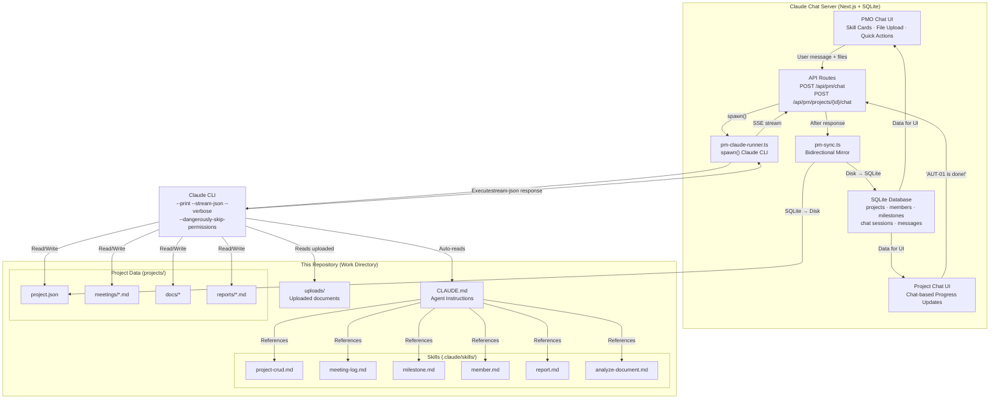
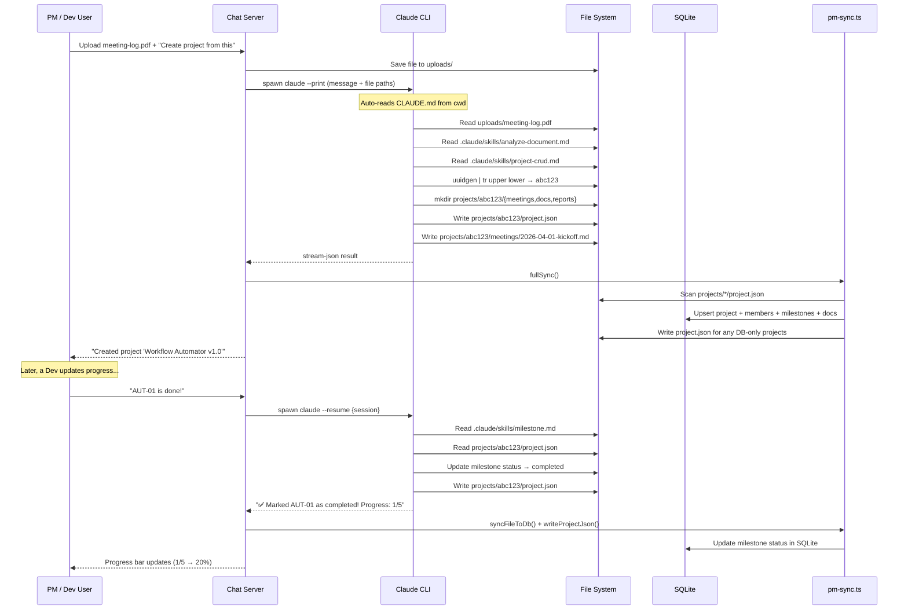
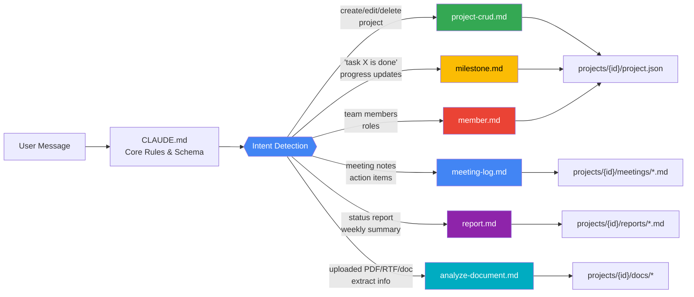
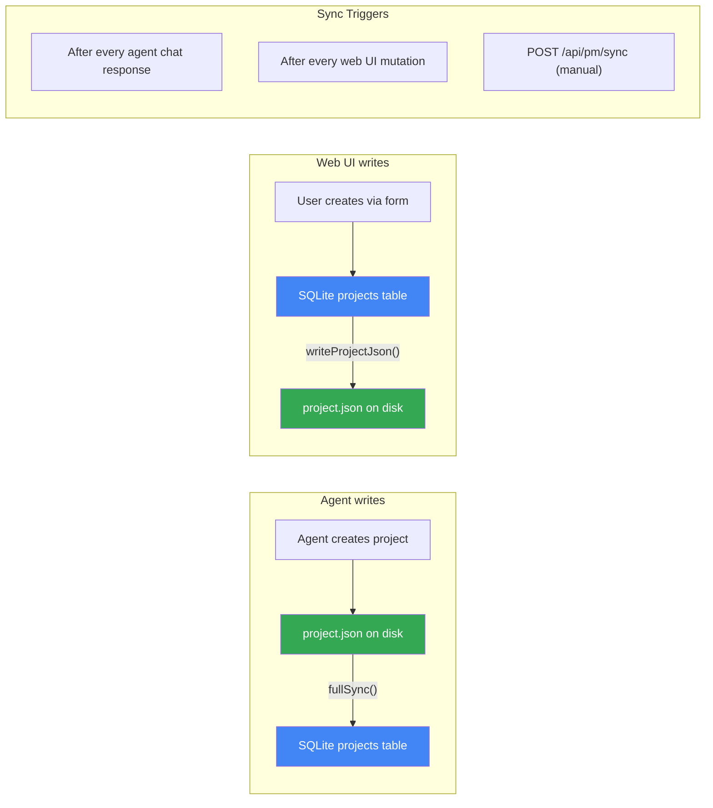
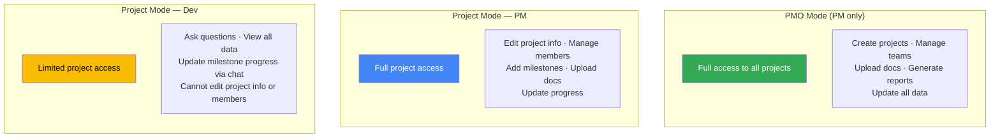

# AI Project Management Agent

A Claude CLI agent harness for managing projects through structured file-based operations. Used as the backend brain for the Claude Chat Server's PMO Assistant.

## Architecture Overview



## How It Works — Full Flow



## Skill Routing



## Bidirectional Sync

SQLite and project.json are always mirrors of each other.



**Sync details:**
- UUIDs normalized to lowercase (agent's `uuidgen` may produce uppercase)
- Members: clear + re-insert with `user_id` preservation by name+email match
- Milestones: clear + re-insert within transaction
- Documents: scans meetings/docs/reports dirs for untracked files
- Uppercase folders renamed to lowercase after sync

## Role-Based Access



## Chat Features

| Feature | PMO Assistant | Project Chat |
|---------|--------------|--------------|
| Multi-session history | Yes (SQLite-backed) | Yes (per user per project) |
| Session titles | Auto from project name or first message | Auto from first message |
| File upload | Drag & drop + attach button | — |
| Supported file types | PDF, RTF, TXT, MD, CSV, JSON, images, HWP, DOC/DOCX, XLS/XLSX | — |
| Skill cards | 6 skill cards on empty state | — |
| Quick actions | List projects, Overall status, Recent meetings | — |
| Progress bar | — | Dev role only (compact header bar) |
| Progress updates via chat | — | "AUT-01 is done!" → auto-updates milestone |
| Markdown rendering | Yes (tables, code blocks, lists) | Yes |
| Chat persistence | Survives refresh/navigation | Survives refresh/navigation |
| Clear/delete sessions | Per session | Per session |

## Skill Details

### project-crud.md
| Operation | Reads | Writes | Confirms? |
|-----------|-------|--------|-----------|
| Create | — | `project.json`, folder structure | No |
| Read | `project.json` | — | No |
| Update | `project.json` | `project.json` (merged) | No |
| Delete | `project.json` | Removes entire folder | **Yes** |

### meeting-log.md
| Operation | Reads | Writes |
|-----------|-------|--------|
| Add Log | `project.json` | `meetings/YYYY-MM-DD-title.md` |
| List Logs | `meetings/*` | — |
| Analyze Transcript | Raw text | Structured `meetings/*.md` |

### milestone.md — Progress Updates
| Operation | Reads | Writes |
|-----------|-------|--------|
| Mark done | `project.json` | `project.json` (status → completed) |
| Reopen | `project.json` | `project.json` (status → pending) |
| Add | `project.json` | `project.json` (appended) |
| View Timeline | `project.json` | — (formatted output) |

Natural language triggers: "task X is done", "AUT-01 completed", "finished the Redis deployment", "mark Design Phase as completed"

### member.md
| Operation | Reads | Writes | Confirms? |
|-----------|-------|--------|-----------|
| Add | `project.json` | `project.json` (appended) | No |
| Update | `project.json` | `project.json` (field merge) | No |
| Remove | `project.json` | `project.json` (filtered) | **Yes** |

### report.md
| Operation | Reads | Writes |
|-----------|-------|--------|
| Status Report | `project.json`, `meetings/*`, `docs/*` | `reports/YYYY-MM-DD-status-report.md` |
| Weekly Summary | `project.json`, `meetings/*` | `reports/YYYY-MM-DD-weekly.md` |

### analyze-document.md
| Operation | Reads | Writes |
|-----------|-------|--------|
| Analyze | Uploaded document (PDF, RTF, Word, images, etc.) | — (returns structured data) |
| Store | Classified document | `meetings/`, `docs/`, or `reports/` |
| Extract Project | Multiple documents | Uses `project-crud` to create |

## Setup

This repository is the **work directory** for the Claude CLI agent. It is referenced by the chat server via the `CLAUDE_WORK_DIR` environment variable.

```bash
# In the chat server's .env.local:
CLAUDE_BIN=/path/to/claude
CLAUDE_WORK_DIR=/path/to/this/repo
```

The Claude CLI automatically reads `CLAUDE.md` from its `cwd`. Skills in `.claude/skills/` are referenced by the agent as needed.

## File Map

```
.
├── CLAUDE.md                          # Master agent instructions
├── .claude/
│   └── skills/
│       ├── project-crud.md            # Create, Read, Update, Delete
│       ├── meeting-log.md             # Meeting notes & transcripts
│       ├── milestone.md               # Progress updates & timeline
│       ├── member.md                  # Team member management
│       ├── report.md                  # Status reports & summaries
│       └── analyze-document.md        # Document analysis & extraction
├── uploads/                           # Uploaded documents (agent reads these)
└── projects/                          # Project data (gitignored)
    └── {uuid}/
        ├── project.json               # Source of truth (synced with SQLite)
        ├── meetings/                   # Meeting logs (.md)
        ├── docs/                       # Supplementary files
        └── reports/                    # Generated reports (.md)
```
